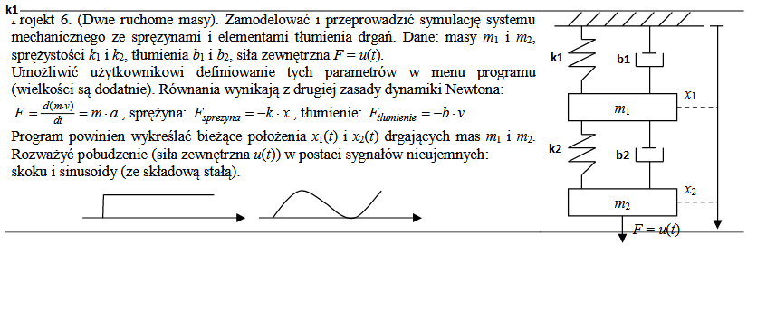

# Projekt z Przedmiotu "Metody Modelowania Matematycznego"

Treść zadania jest przedstawiona na zdjęciu poniżej:

Program został stworzony w C++ gdzie są wykonywane obliczenia i zostaje wygenerowany plik tekstowy z wartościami w zadanych wartościach czasu, oraz w Pythonie gdzie zostało wykonane GUI zczytujące wartości parametrów i generując z nich plik tekstowy (Używany w kodzie c++), a następnie po zczytaniu wyników generuje wykresy x1 i x2.  
Jednostki wartości do wpisania są początkowo podane w polach, program wyrzuca błąd gdy któryś z input ma w sobie inną wartość niż float.  
Aby wygenerować wykres należy wpisać odpowiednie wartości, zaznaczyć pobudzenie sinusoidalne lub skokowe i nacisnać przycisk do generacji wykresu.
## Authors

- [Kamil Włodarczyk](https://github.com/KamilWlodarczyk2003)
- [Kajetan Zawadka](https://github.com/Kajtuch)

